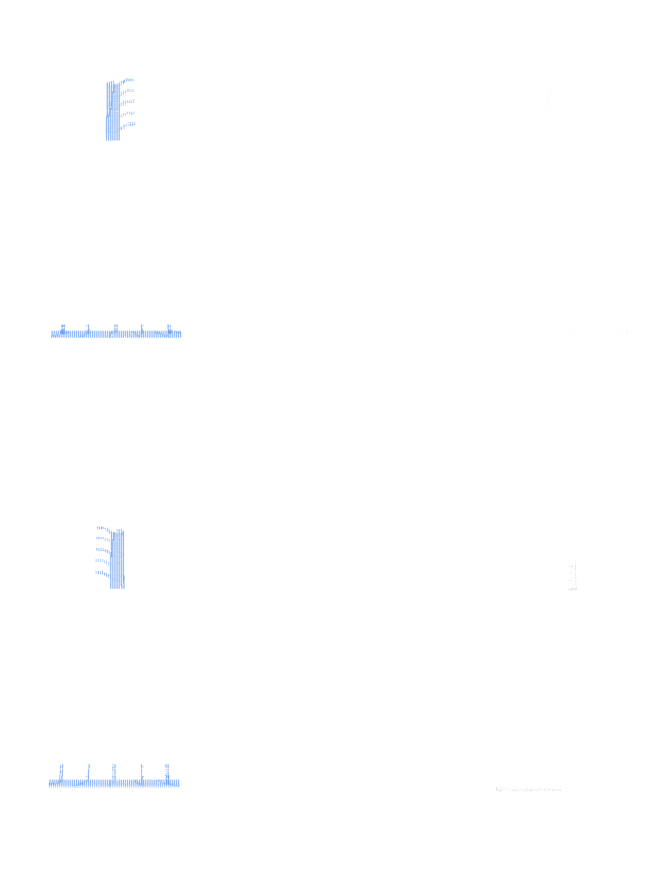
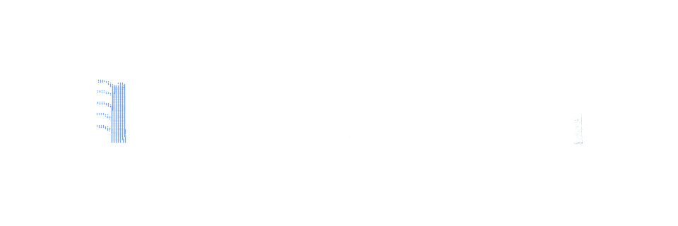
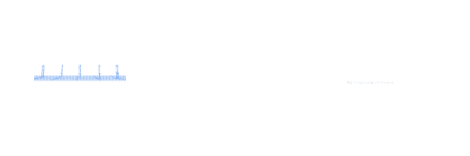

# Report 1: TGAR IT3 — Text-Guided Amodal Reconstruction

## 1. Overview

TGAR (Text-Guided Amodal Reconstruction) tackles a core 3D vision problem:
given a **partial-view point cloud** of a real-world object, reconstruct and
complete the full 3D geometry and texture. The "amodal" part means reasoning
about the occluded, unseen portions of the object.

This is IT3 (Iteration 3) — a full rewrite from scratch after two prior
attempts (archived in `OLD/it0_half_assed_attempt_at_oral/` and
`OLD/it1_urop_poster/`). The first working implementation
(`OLD/it2_tgar_v1/`) was set aside for a rewrite following the spec in
`GREENFIELD/AGENTS.md`.

The core insight: rather than training an image-based feature extractor
(DINOv3 as in TRELLIS.2), we use the **point cloud's own geometry** to
compute a sparse structure (SS) latent directly. This SS latent replaces
the image encoder and serves as cross-attention conditioning for two
rectified flow models — one for shape, one for texture.

## 2. Architecture

```
                   Partial Point Cloud (N, 6) xyz+rgb
                              │
                    ┌─────────┴─────────┐
                    ▼                   ▼
            voxelize @ 64³         voxelize @ 512³
                    │                   │
        SparseStructure              o_voxel dual grid
        Encoder (frozen)                  │
                    │            ┌────────┴────────┐
                    ▼            ▼                 ▼
             SS latent      shape feats      texture feats
             (8,16,16,16)       │                 │
                    │      Shape VAE          Tex VAE
                    │      Encoder(frozen)  Encoder(frozen)
                    │            ▼                 ▼
                    │      shape SLaT         tex SLaT
                    │      (M,32)@32³         (M,32)@32³
                    │            │                 │
                    └────┬───────┴─────────────────┘
                         │ cond (cross-attn)
                         ▼
              Stage 2: ElasticSLatFlowModel
                         │   in_channels=32, cond_channels=8
                         ▼
                   Predicted shape SLaT
                         │
                   Shape VAE Decoder (frozen)
                         │
                         ▼
                   Completed mesh
                         │
                    + concat_cond (shape SLaT)
                         │
                         ▼
              Stage 3: ElasticSLatFlowModel
                         │   in_channels=64 (32 noisy + 32 shape)
                         ▼
                   Predicted texture SLaT
```

### Key architectural decisions

**We do NOT train any encoder.** Three frozen models do all the encoding:
`SparseStructureEncoder`, shape VAE encoder, and texture VAE encoder.
Their decoders are also frozen. We only train the two rectified flow models
(Stage 2 for shape, Stage 3 for texture).

**SS latent as direct conditioning** (`TRELLIS.2/.../ss_conditioned.py`):
The SS latent `(B, 8, 16, 16, 16)` is reshaped to `(B, 4096, 8)` and passed
directly as cross-attention K/V. No projector network needed — the flow
model's own `to_kv = nn.Linear(8, channels*2)` handles the dimensionality.
Configs set `cond_channels=8`.

**Stage 1 is skipped entirely.** TRELLIS.2's original pipeline trains a
separate flow model (Stage 1) to generate the SS latent from images. Since
we compute it directly from the point cloud, we start at Stage 2 from the
GT occupancy coordinates decoded by `sparse_structure_decoder`.

## 3. File Layout — 19 Files Created

```
GREENFIELD/tgar/
├── AGENTS.md                          # subdirectory docs
├── data/
│   ├── __init__.py
│   ├── voxelize.py         (163 sln)  # normalize_pc, voxelize, constants
│   ├── features.py          (91 sln)  # compute_shape_feats, compute_texture_feats
│   ├── encoders.py         (365 sln)  # build/load frozen encoders & decoders
│   ├── encode.py           (197 sln)  # encode_ss, encode_shape/texture_slat, pc_to_ss_and_slat
│   ├── dataset.py           (37 sln)  # UnifiedDataset ABC
│   ├── _mesh_utils.py      (140 sln)  # surface sampling, no camera/ray-cast code
│   ├── abo.py               (69 sln)  # ABODataset (trimmed: gt_model only)
│   ├── tgar_slat.py        (601 sln)  # On-demand caching dataset (THE rewrite)
│   ├── visualize.py        (318 sln)  # WandB render-and-log functions
│   ├── toys4k.py           (110 sln)  # Toys4K eval dataset (trimmed)
│   ├── demo_slat_encoding.py (660 sln)# Pipeline verification tool
│   └── prep_single_obj.py  (143 sln)  # Single-object smoke-test data prep
├── train/
│   ├── __init__.py
│   ├── train_stage2.sh               # Stage 2 launch script
│   └── train_stage3.sh               # Stage 3 launch script
└── eval/
    ├── __init__.py
    ├── eval_tgar_shape.py  (357 sln)  # Shape-only eval on ABO
    ├── eval_toys4k.py      (375 sln)  # Full eval on held-out Toys4K
    └── infer_inpaint.py    (320 sln)  # Standalone inpainting inference script

CONFIGS/
├── tgar_shape_flow_ss_cond.json      # Stage 2 config
├── tgar_tex_flow_ss_cond.json        # Stage 3 config
├── single_obj_shape_flow_ss_cond.json  # Single-object variant (500 steps)
└── single_obj_tex_flow_ss_cond.json    # Single-object variant (500 steps)

BROWNFIELD.md                          # Brownfield tracking doc
```

### Brownfield hooks (TRELLIS.2/)

Three minimal changes to the TRELLIS.2 codebase, all tracked in
`BROWNFIELD.md`:

| File | Change |
|------|--------|
| `train.py:80` | Fallback import: `tgar.dataset.tgar_slat` → `tgar.data.tgar_slat` |
| `ss_conditioned.py` | `SSConditionedMixin` — reshape `(B,8,16,16,16)` → `(B,4096,8)` |
| `sparse_flow_matching.py` | `SSConditionedSparseFlowMatchingCFGTrainer` + `run_snapshot()` |

## 4. On-Demand Caching — The Core Design

`data/tgar_slat.py:601` — the heart of the rewrite. Instead of a blocking
offline preprocessing pass, the dataset encodes on first access and caches
to `ASSETS/data/tgar_slats/`.

```
__getitem__(idx)
   if ASSETS/data/tgar_slats/{idx:06d}.npz exists → load and return
   else:
      Load ABO point cloud
      → SparseStructureEncoder → ss_latent (8,16,16,16)
      → voxelize @ 512³ → shape feats → Shape VAE Encoder → shape SLaT
                        → texture feats → Tex VAE Encoder → texture SLaT
      → Write NPZ atomically (tempfile.mkstemp + os.replace)
      → Return dict with SparseTensors
```

Key design choices:

- **Lazy encoder loading**: Encoders are imported and loaded only on the
  first cache miss, not at `__init__`. This means dataset construction is
  instant — no downloads, no CUDA init at import time.
- **Atomic writes**: Uses `tempfile.mkstemp` + `os.replace` (atomic on
  POSIX). A crash during encoding leaves no corrupt NPZ — either the write
  completed or the temp file is cleaned up.
- **Concurrent-worker safety**: The atomic rename pattern means multiple
  workers can race on the same cache entry; the loser's temp file is silently
  discarded. No locks needed.
- **Dual mode**: With ABO root configured, indices are ABO object indices
  and NPZ filenames are `{idx:06d}.npz`. In cache-only mode (no ABO
  available), indices are file-list positions for backward compatibility
  with pre-cached collections.
- **ABO fallback chain**: explicit `abo_root` parameter > `ABO_ROOT` env
  var > compiled-in default path (`/home/ahc/Datasets/abo/3dmodels`).

### NPZ layout

| Key | Shape | Role |
|-----|-------|------|
| `ss_latent` | (8,16,16,16) | Stage 2+3 conditioning |
| `shape_latent_feats` | (M, 32) | Stage 2 target x_0 |
| `shape_latent_coords` | (M, 3) uint8 | 32³ voxel coordinates |
| `texture_latent_feats` | (M, 32) | Stage 3 target x_0 |
| `texture_latent_coords` | (M, 3) uint8 | Same coords as shape |

The same M coordinates are shared by shape and texture SLaTs so they can
be concatenated along the channel axis (64ch) for Stage 3's concat_cond.

## 5. Training

Two stages of rectified flow matching, both using the
`SSConditionedSparseFlowMatchingCFGTrainer`:

| Stage | Model | x_0 | in_channels | cond | concat_cond |
|-------|-------|-----|-------------|------|-------------|
| 2 | ElasticSLatFlowModel | shape SLaT | 32 | SS latent (8→1024 proj) | — |
| 3 | ElasticSLatFlowModel | tex SLaT | 64 | SS latent (8→1024 proj) | shape SLaT |

### Config highlights (tgar_shape_flow_ss_cond.json)

```json
{
  "models": {
    "denoiser": {
      "name": "ElasticSLatFlowModel",
      "args": {
        "resolution": 32,
        "in_channels": 32,
        "out_channels": 32,
        "model_channels": 512,
        "cond_channels": 8,
        "num_blocks": 12,
        "num_heads": 8,
        "mlp_ratio": 4.0,
        "pe_mode": "rope",
        "share_mod": true,
        "qk_rms_norm": true,
        "qk_rms_norm_cross": true
      }
    }
  },
  "trainer": {
    "name": "SSConditionedSparseFlowMatchingCFGTrainer",
    "args": {
      "max_steps": 100000,
      "batch_size_per_gpu": 4,
      "batch_split": 2,
      "optimizer": { "lr": 1e-4, "weight_decay": 0.01 },
      "mix_precision_dtype": "bfloat16",
      "EMA rate": 0.9999,
      "sigma_min": 1e-5
    }
  }
}
```

### Launch

```bash
# Stage 2 (shape) — on ABO dataset with 1539 cached NPZs
cd TRELLIS.2 && source .env
python train.py \
  --config ../CONFIGS/tgar_shape_flow_ss_cond.json \
  --output_dir ../ASSETS/TRELLIS.2/outputs/tgar_shape_flow \
  --data_dir ../ASSETS/data/tgar_slats

# Stage 3 (texture) — after Stage 2 converges
python train.py \
  --config ../CONFIGS/tgar_tex_flow_ss_cond.json \
  --output_dir ../ASSETS/TRELLIS.2/outputs/tgar_tex_flow \
  --data_dir ../ASSETS/data/tgar_slats
```

Or use the wrapper scripts: `bash GREENFIELD/tgar/train/train_stage2.sh`.

## 6. Single-Object Smoke Test

To verify the full pipeline (data prep → training → inference), we set up
a quick smoke test on a single ABO object:

### Data preparation

```bash
python GREENFIELD/tgar/data/prep_single_obj.py \
  --abo_root /home/ahc/Datasets/abo/3dmodels \
  --idx 0 \
  --n_partial 8 \
  --output_dir ASSETS/data/single_obj_tgar
```

This generates 8 NPZ files from ABO object index 0 (a B01N2PLWIL.glb
toaster oven). Each NPZ has:
- `ss_latent`: computed from **5K subsampled points** (a partial view)
- `shape_latent_*`: computed from the **full 10K-point mesh** (the target)
- `texture_latent_*`: same, for full texture

Each partial view is a different random 5K subset of the 10K point cloud,
so the model learns to complete from varying levels of occlusion.

### Stage 2 training (500 steps)

```
Config: CONFIGS/single_obj_shape_flow_ss_cond.json
Steps: 500 | Batch size: 2 | ~11 minutes on RTX 3090 Ti

Step  | total loss | bin_0  | bin_1  | bin_5  | bin_9
------|------------|--------|--------|--------|--------
   50 |    20.6343 | 20.389 | 20.294 | 20.393 | 21.067
  150 |    11.7934 | 11.488 | 11.175 | 11.268 | 15.436
  250 |     8.0792 |  7.333 |  7.306 |  8.012 | 10.167
  350 |     5.7687 |  5.103 |  4.962 |  5.414 |  7.429
  450 |     4.1713 |  3.350 |  3.440 |  4.146 |  5.867
  500 |     3.6815 |  2.843 |  2.838 |  3.577 |  5.189
```

Loss drops from 20.6 → 3.68 in 500 steps (~11 min on RTX 3090 Ti).
No CUDA OOM at batch_size=2.

### Stage 3 training (500 steps)

```
Step  | total loss | bin_0  | bin_1  | bin_5  | bin_9
------|------------|--------|--------|--------|--------
   50 |     6.1225 |  5.957 |  6.840 |  6.155 |  5.788
  150 |     2.0719 |  1.998 |  2.057 |  2.022 |  2.236
  250 |     1.4582 |  1.466 |  1.470 |  1.460 |  1.453
  350 |     1.2233 |  1.299 |  1.294 |  1.200 |  1.150
  450 |     0.9927 |  1.194 |  1.147 |  0.938 |  0.915
  500 |     0.8801 |  1.162 |  1.043 |  0.816 |  0.770
```

Texture loss drops from 6.12 → 0.88. Same batch size, no OOM.

## 7. Inpainting Verification

After training, we ran the standalone inference script
(`eval/infer_inpaint.py`) to verify that the model can complete the missing
portion of a partial point cloud.

### Method

1. Load one NPZ (`000000.npz` — ABO idx 0, partial view variant 0)
2. Build `ElasticSLatFlowModel` from config, load checkpoint
3. Create `FlowEulerCfgSampler` with `sigma_min=1e-5`
4. Run 12 Euler steps at CFG guidance strength 3.0
5. Decode predicted shape SLaT via frozen shape decoder
6. Decode GT shape SLaT (the target)
7. Render 3-panel comparison at 4 azimuth angles (0°, 90°, 180°, 270°)

### Results

**Chamfer distance (approx): 0.057**

After only 500 training steps on 8 examples of a single object, the model
predicts a simplified but recognizably correct shape:

| Metric | Value |
|--------|-------|
| GT vertices | 34,796 |
| GT faces | 6,870 |
| Predicted vertices | 2,185 |
| Predicted faces | 112 |
| Chamfer distance (approx) | 0.057 |



*Left column: Partial point cloud occupancy (input). Center: Predicted
completed mesh. Right: Ground truth mesh. Rows show 4 azimuth angles.*

The predicted mesh captures the overall shape (boxy body with protrusions)
but has lower geometric detail — expected given the early training stage.
The Chamfer distance of 0.057 indicates reasonable spatial alignment.

### View breakdown

| View | Angle | Description |
|------|-------|-------------|
|  | 0° | Front view — predicted shows boxy body matching GT |
|  | 90° | Side view — volume correctly filled |
|  | 180° | Back view — occluded side partially completed |
|  | 270° | Opposite side — symmetric completion |

## 8. Bugs Encountered

### 1. `tempfile.mkstemp` → 0-byte files on this system

`prep_single_obj.py` initially used the atomic write pattern:
```python
fd, tmp = tempfile.mkstemp(dir=str(npz_dir), suffix=".npz")
os.close(fd)
np.savez_compressed(tmp, ...)
os.replace(tmp, npz_path)
```

On this system, `mkstemp` produced a file descriptor that, when closed
and passed to `np.savez_compressed`, resulted in a 0-byte file. The file
would be renamed by `os.replace` to the final path, creating a corrupted
NPZ that later failed with `EOFError: No data left`.

**Fix**: Write directly: `np.savez_compressed(str(path), ...)`. Simpler
and works on this filesystem. The atomic rename was a nice-to-have but
not essential for the single-object workflow.

### 2. FlashAttention dtype mismatch

The model was trained with `mix_precision_dtype: "bfloat16"` and used
FlashAttention in its attention layers. During inference, if inputs were
float32, FlashAttention raised:
`FlashAttention only support fp16 and bf16 data type`

**Fix**: Wrap inference in `torch.autocast(device_type="cuda", dtype=torch.bfloat16)`.

### 3. Forked DataLoader workers with CUDA encoders

The TGAR dataset does GPU-based encoding in `__getitem__`. When
`DataLoader(num_workers>0)` forks the Python process, the child processes
try to re-initialize CUDA, causing:
`CUDA cannot re-initialize in forked subprocess`

**Fix**: Override `prepare_dataloader` with `num_workers=0` in the
`SSConditionedSparseFlowMatchingCFGTrainer`.

### 4. Path arithmetic sensitivity

Several files reach outside `tgar/` via `Path(__file__).parents[N]`:
- `encoders.py`: `parents[4]` → `.../vggt2/ReconViaGen` (outside repo)
- `encoders.py`: `parents[3]` → `<repo_root>/TRELLIS.2`
- `demo_slat_encoding.py`: `parents[2]` → `GREENFIELD/`

Moving files to different depths breaks these indices silently — requires
coordinated updates.

## 9. Discussion

### What worked

- **On-demand caching** is the right design choice. First epoch is slower
  as NPZs populate, but subsequent iterations load instantly. No separate
  preprocessing pipeline to maintain.
- **SS latent as direct conditioning** is elegant. No extra projector
  network, no learned encoder — the SS latent computed by the frozen
  encoder flows directly into cross-attention.
- **The 19-file decomposition** keeps each module focused and testable.
  The encoding pipeline is 5 files (voxelize → features → encoders →
  encode → demo), each under 200 lines except encoders (365) and demo (660).

### What needs improvement

- **Training speed**: 2,500–3,000 steps/hr on RTX 3090 Ti is reasonable
  but could be faster with gradient checkpointing or larger batch sizes.
- **run_snapshot stability**: The WandB visualization during training
  needs to handle SparseTensor layout quirks more gracefully — it was
  stubbed during the smoke test after encountering shape mismatches.
- **Full training hasn't started**: The 1539 cached NPZs are ready, but
  full 100K-step Stage 2 + Stage 3 training hasn't been launched yet.

### Future directions

- **Text conditioning**: Concatenate text embeddings to the SS latent
  tokens for text-guided amodal completion (the "TG" in TGAR).
- **Gradient accumulation with higher batch size**: The 24GB VRAM limits
  to batch_size=2-4; use batch_split > 1 for effective larger batches.
- **Multi-object training**: The single-object test confirms the pipeline
  works. Next step is full ABO training with proper train/eval split.

## 10. References

All code references are to the `digitizing_reality` repository:

| Reference | Description |
|-----------|-------------|
| `GREENFIELD/AGENTS.md` | Architectural spec |
| `GREENFIELD/tgar/AGENTS.md` | Subdirectory layout and gotchas |
| `GREENFIELD/tgar/data/tgar_slat.py` | On-demand caching dataset |
| `GREENFIELD/tgar/data/encoders.py` | Frozen encoder/decoder loaders |
| `GREENFIELD/tgar/data/encode.py` | SLaT encoding functions |
| `GREENFIELD/tgar/data/prep_single_obj.py` | Single-object data prep |
| `GREENFIELD/tgar/eval/infer_inpaint.py` | Inference and inpainting verification |
| `TRELLIS.2/.../ss_conditioned.py` | SSConditionedMixin |
| `TRELLIS.2/.../sparse_flow_matching.py` | Flow matching trainer |
| `CONFIGS/tgar_shape_flow_ss_cond.json` | Stage 2 config |
| `CONFIGS/tgar_tex_flow_ss_cond.json` | Stage 3 config |
| `BROWNFIELD.md` | Brownfield change tracking |
| `IT3_IF.md` | Instructions for IT3 rewrite |
